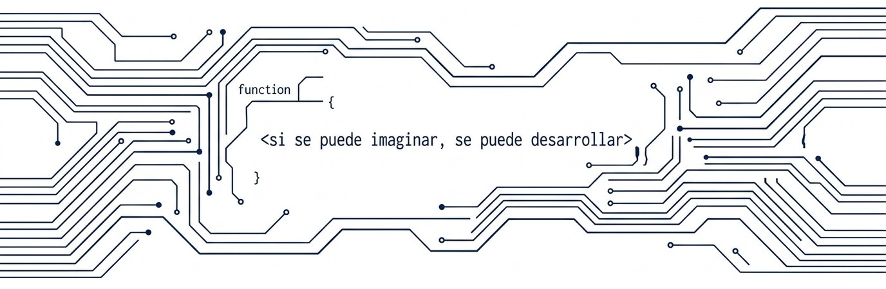

  <!-- Banner corporativo de tecnología generado a medida -->
  

<h1 align="center">Hola, soy Liz Andrea Ramos 👋</h1>
<h3 align="center">Desarrolladora de Software Corporativo & Backend 🚀</h3>

  
  

 

  <b>Ingeniera de Sistemas especializada en el ecosistema Java (Spring, Quarkus) y el diseño de APIs corporativas.</b> 
  Poseo sólida experiencia en el desarrollo y mantenimiento de soluciones seguras, escalables y de alto rendimiento. Apasionada por el diseño de arquitecturas robustas (Patrón Hexagonal, SOLID), bases de datos complejas (PostgreSQL, Oracle), y el desarrollo Full-Stack interactivo con Angular. También me dedico a la docencia técnica, aportando valor mediante la enseñanza y la mentoría.

---

### 💻 Stack Tecnológico Principal

  <!-- skillicons.dev provee iconos limpios y modernos -->
  

 

  <b>Backend & APIs:</b> 
  
  
  
  
  

 

  <b>Frontend & UI:</b> 
  
  
  
  
  
  

 

  <b>Bases de Datos & DevOps:</b> 
  
  
  
  
  
  

 

  <b>Inteligencia Artificial & Herramientas:</b> 
  

    Modelos (Gemini 3.5, GLM5) • Kilo Code (Kimi, Qwen) • Antigravity • Nano Banana • Flow 
    <i>Manejo de CLI (VSCode, Antigravity) y desarrollo guiado por especificaciones con Speckit.</i>
  

  
  
  
  
  

---

  <i>"Si se puede imaginar, se puede desarrollar." - Liz Andrea Ramos</i>

